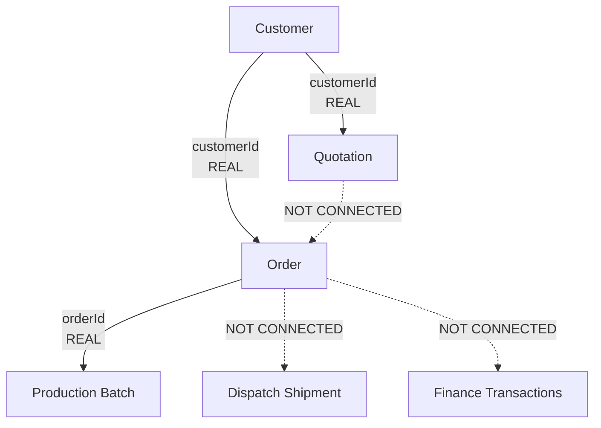
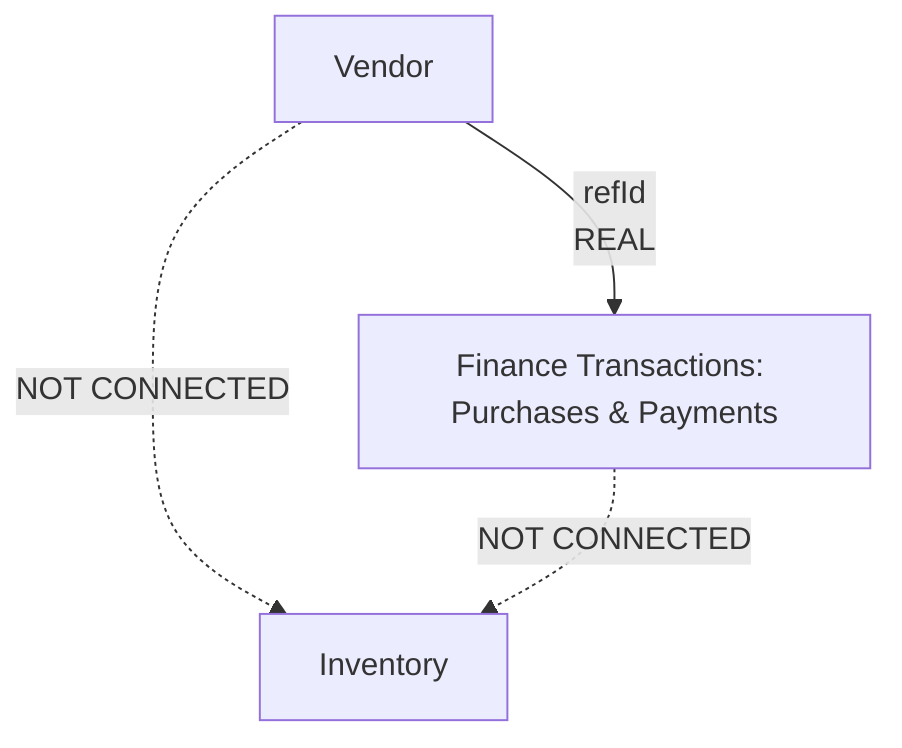

# Garment OS Architecture Audit
**Current Data Relationships & Business Workflow**

This document outlines the *actual* data relationships and business workflows currently implemented in the Garment OS codebase, based strictly on the SQLite database schema (`schema.sql`), API service (`api.js`), and frontend stores.

---

## Entity Relationship Breakdown

### 1. CUSTOMERS
- **What records belong to a customer?** Orders and Quotations.
- **Are quotations connected to customers?** **[REAL / CONNECTED]** Quotations store a `customerId` foreign key.
- **Are orders connected to customers?** **[REAL / CONNECTED]** Orders store a `customerId` foreign key.
- **Are finance transactions connected to customers?** **[NOT CONNECTED]** Transactions do not currently use `customerId` directly to compute customer balances.
- **How are customer statistics calculated?** **[PARTIAL]** Statistics (`totalRevenue`, `outstanding`, `completedOrders`) are calculated dynamically in `api._enrichCustomerStats`, but they are derived strictly from the `orders` table (summing order `value` and checking order `status`), NOT from actual finance transactions.

### 2. QUOTATIONS
- **How is a quotation connected to a customer?** **[REAL / CONNECTED]** via `customerId`.
- **What information is stored?** Customer reference, date, status, JSON list of items, total amount, and notes.
- **Can an accepted quotation become an order?** **[UI ONLY / NOT CONNECTED]** The schema for `orders` does not contain a `quotationId` reference. There is no direct backend data flow linking a converted quotation to a new order.

### 3. ORDERS
- **How is an order connected to a customer?** **[REAL / CONNECTED]** via `customerId`.
- **Does it contain quotationId?** **[NOT CONNECTED]** No.
- **What determines the order value?** Stored directly in the `orders` table (`value`, `subtotal`, `grandTotal`).
- **Is an order connected to Finance?** **[NOT CONNECTED]** Order payment status (`paymentStatus`, `paymentReceived`) is stored directly on the order record. It is not dynamically calculated from the `transactions` table.
- **Is an order connected to Production?** **[REAL / CONNECTED]** Production batches store an `orderId`.
- **Is an order connected to Dispatch?** **[NOT CONNECTED]** Shipments have a `customerName` text field, but no `orderId` or `customerId` foreign key.

### 4. FINANCE / TRANSACTIONS
- **What exactly is a Finance transaction?** A record of cash flow (Income/Expense/Payment) storing `amount`, `type`, `date`, `category`, and `isNegative`.
- **Can a transaction be associated with a customer or order?** **[PARTIAL]** The schema has `linkedOrderId` and `linkedBatchId` fields, but the current API/UI does not actively use them to calculate customer receivables or order payment statuses.
- **Can it be associated with a vendor?** **[REAL / CONNECTED]** via `refId = vendorId`.
- **How are payables calculated?** **[REAL / CONNECTED]** Vendor outstanding payables are dynamically calculated by summing 'Purchase' transactions and subtracting 'Payment' transactions tied to the vendor's `refId`.
- **How are receivables calculated?** **[UI ONLY / PARTIAL]** Customer receivables are just derived from Order values where status is 'Pending/Processing', ignoring actual finance transactions.

### 5. VENDORS
- **What vendor data currently exists?** Full contact, banking, and status details.
- **Is Vendor connected to Finance?** **[REAL / CONNECTED]** Yes, purchases and payments are logged as finance transactions linked via `refId`. Vendor statistics are calculated dynamically from these real transactions.
- **Is Vendor connected to Inventory?** **[NOT CONNECTED]** Inventory items have no `vendorId`.

### 6. INVENTORY
- **Are inventory items connected to vendors?** **[NOT CONNECTED]** No `vendorId` exists in the inventory schema.
- **Are inventory movements connected to orders?** **[NOT CONNECTED]** `orders` and `batches` store text arrays or JSON for fabric/consumptions, but there is no real-time deduction from the `inventory` table.
- **Are inventory costs connected to Finance?** **[NOT CONNECTED]**

### 7. PRODUCTION (Batches)
- **Is production connected to a specific order?** **[REAL / CONNECTED]** via `orderId` on the batch record.
- **Is production progress associated with an order?** **[REAL / CONNECTED]** Yes, batches track `progress` and `phase` for a specific order.

### 8. DISPATCH (Shipments)
- **Is a shipment connected to an order?** **[NOT CONNECTED]** The `shipments` table only stores `customerName`, `invoiceNo`, and a JSON array of boxes/products. It lacks an `orderId` or `customerId` foreign key.

---

## Current Foreign Keys in Schema

| Table | Stores Foreign Key | References |
| :--- | :--- | :--- |
| **quotations** | `customerId` | Customers |
| **orders** | `customerId` | Customers |
| **orders** | `costingId` | Costings |
| **batches** | `orderId` | Orders |
| **transactions** | `refId` | Vendors |
| **transactions**| `linkedOrderId`, `linkedBatchId` | (Present in schema, mostly unused) |

---

## Current Workflow Diagrams

### Customer & Order Workflow

*Note: Quotations do not flow into Orders. Orders do not automatically generate Dispatch records or Finance receivables. Order payments are updated manually on the Order record.*

### Vendor & Purchasing Workflow

*Note: Vendor purchases affect Finance, but they do not automatically update Inventory stock levels.*

---

## Summary

> [!IMPORTANT]
> **CURRENT SYSTEM — WHAT IS ACTUALLY WIRED**
> - **Customers → Orders**: Fully wired. Creating an order links it to a customer, and customer stats (like revenue and active orders) are calculated dynamically from those orders.
> - **Customers → Quotations**: Fully wired. Quotations are linked to specific customers.
> - **Orders → Production**: Fully wired. Batches are created for specific `orderId`s.
> - **Vendors → Finance**: Fully wired. Vendor balances (outstanding payables) are correctly calculated from real Finance transactions (Purchases - Payments).

> [!WARNING]
> **CURRENT SYSTEM — WHAT IS NOT WIRED**
> - **Quotations ⇏ Orders**: You cannot formally convert a Quotation into an Order and track the lineage (no `quotationId` on orders).
> - **Orders ⇏ Finance**: When an order is paid, it does not create a Finance transaction, and Finance transactions do not update Order payment statuses. They live in silos.
> - **Orders ⇏ Dispatch**: Shipments are completely detached from Orders and Customers. They only store a text `customerName`.
> - **Vendors ⇏ Inventory**: Buying materials from a vendor logs a finance transaction, but does not increase inventory stock.
> - **Production ⇏ Inventory**: Consuming materials in a production batch does not decrease inventory stock.
